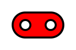

# merkur5 

A set of PHP helpers and utilities to make the web database-driven applications easier.
Minimalistic and primitive.


Currently in progress ..


The design is a targeted to make simple server-side development with a minimum source code length and simple functionality .

The set constists of :
 
- the kernel library (static PHP class/module object called M5),
- database wrappers with unified behaviour, database connection objects with same methods for Oracle, SQLite, PostgreSQL and MySQL including inified parameter binding
- parts for visualization of the database entities 
- built-in content management system (**Cm::** module), minimal version can be stored in the SQLite database.
- included recommended vendor styles and front-end functionality (Bootstrap + JQuery included)
- included application template with **Cm::** module for starting make complex apps

## Concept and Ideas

- Root component is a **M5::** module. Most of its methods can be called as **global functions** . 
- The HTML/XML output is generated using function **ta()**, **tg()** and other global functions generating HTML/XML strings. 
 No HTML/XML tags in the code. All these functions are naturaly nested to generate output. The result is pushed into a
 buffer using **htpr()** function. The page template is separated from the code.
- Built-in set of frequently used SVG icons for tool buttons. 
- The input is processed via **getpar()** function with sanitization possibilities and optional defaults.
- More complex application are decomposed into a separate parts/componets using content management class **Cm::**, 
 which includes "user in group" rights management, application logging and standard left user-sensitive menu.
- The components have **route()** and/or **skeleton()** method. 
These methods are called to process the required application functionality 
- High portability: PHP versions from PHP 5.3 to PHP 7.4 are supported
- Simple debugging functionality with the **deb()** function, self-documentation 
functionality using the PHP reflexive class      

## Code example

### Object - oriented approach

```PHP

include_once '../lib/mlib.php';

class Hello extends M5{

  static function skeleton($path=''){
    self::set('header','Minimal application');  /* page header */ 
    parent::skeleton();                         /* implicit route */
    htpr(ta('h1','Minimal application'),        /* */
         ta('p','That\'s it !'));
    self::done();                               /* buffer write */       
  }

} 

/* singleton design */

Hello::skeleton(); 

``` 

### Sequencional approach with high effectivity of code

```PHP
include_once "../lib/mlib.php";
M5::set('header',,'Minimal application'); 
M5::skeleton(); 
htpr(ta('h1','Minimal application'),ta('p','That\'s it !')); 
M5:done();                  
```
notice: this 5 lines of code generate a complex HTML/CSS styled page
  with one header and one paragraph of text based on default frontend template

### Database table entity lister

```PHP
include_once '../lib/mlib.php';
include_once '../lib/mbt.php';
M5::set('header','Test Lister');
M5::skeleton('../');

$db = new OpenDB_Oracle(CONN_PATH);
$where="id<18";
$pole=$db->SqlFetchArray(
    "select id, nazev, ochrana_stup_kod, ochrana_kat_kod, ochrana_dop ".
    "from dat_lok1.lok where $where",[],15,getpar('_ofs',1));
$total=$db->SqlFetch("select count(*) as pocet from dat_lok1.lok where $where",[]);
htpr(
   bt_lister(
      'Nalezené lokality',
      ['ID'=>'Id lok.',
        'NAZEV'=>'Název',
        'OCHRANA_STUP_KOD'=>'Kód ochrany',
        'OCHRANA_KAT_KOD'=>'Kategorie ochrany',
        'OCHRANA_DOP'=>'Doporučení ochrany'],
       $pole,
       'Nejsou záznamy.','',
       bt_pagination(getpar('_ofs',1),$total,15)));
   
M5:done;
```

